## Generations of Running Applications
--------------------------------------
* Applications bring revenue, To make applications run we need servers.
* There are 3 major generations/approaches of running applications on servers
* Sample Application Architecture
* 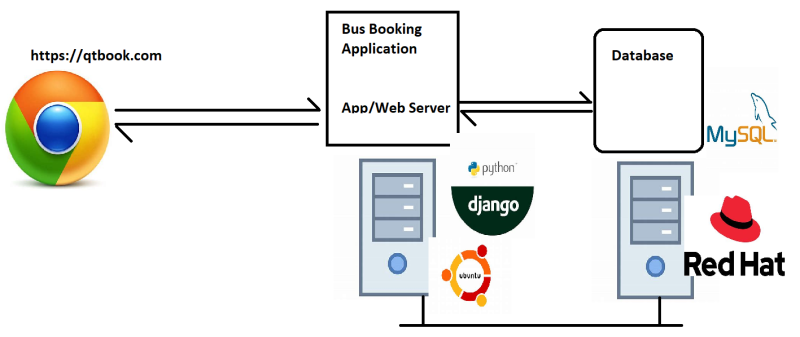
* **Generation 1**: Run directly on physical server
* **Generation 2**: Hypervisors
* **Generation 3**: Containers
   * Container is an isolated area created by container engine (docker) which has a lean os and application runs inside container.
   * Each container gets
       * an ip address
       * cpu
       * RAM
* 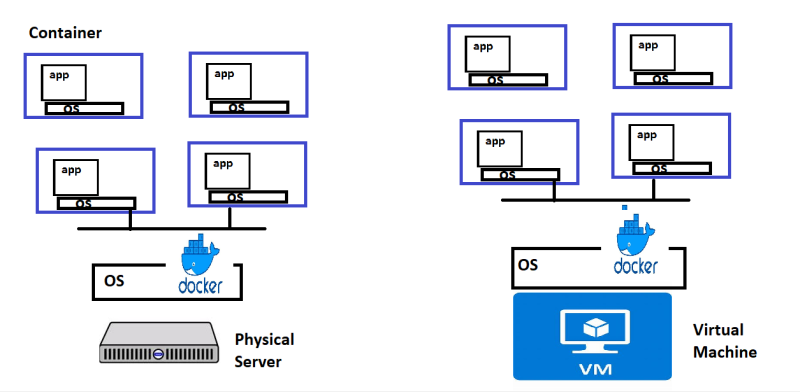

* Lets focus on app tier/layer. This does the following functions
  * Administration
  * User Management
  * Inventory
  * Catalog
  * Cart
  * Payments
  * Notifications
## Micro Services
----------------
* This is all about breaking a monolith to multiple smaller services
* Each micro service generally represents a module/functionality which can run on its own
* Smaller changes are possible and replacing services is easier (new versions)
* Each service can be in different technology.
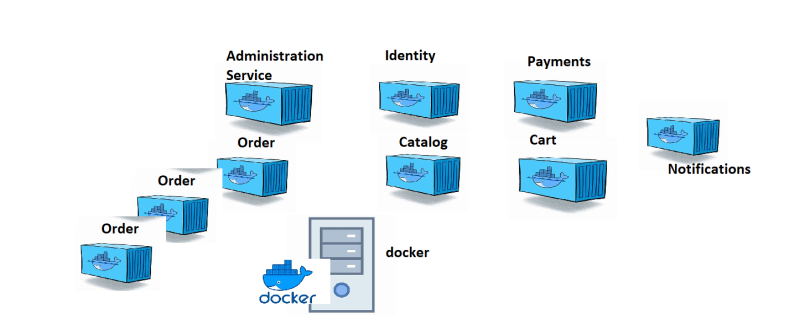
## What is that we need to do this
* Make your application/service run inside containers => containerization => Docker
* Ensure we can scale containers automatically/manually (k8s)
* Enable CI/CD pipepline to make smaller changes frequently without downtime. (k8s)
## docker installation
----------------------
```
curl -fsSL https://get.docker.com -o get-docker.sh
sh get-docker.sh

sudo usermod -aG docker <username>
#exit and relogin
docker info
# This command should not give any errors
```
* To run a container we need a docker image
* Docker images are available on docker registries. The default docker registry is docker hub
* **create a container**-->
* `docker container run <image-name>`
## What happens at a highlevel during container creation
--------------------------------------
* docker client forwards the request to docker engine/docker daemon
* docker engine checks for existence of images locally
* If the image is not found, it tries to download from the configured registry (by default docker hub is configured)
* Once the image is downloaded, the docker engine creates a container based on docker image
* To download the image from registry we use pull. if we create a new image in some machine to make it available in your repository we will be using push
## Image and Tag
----------------
* Any docker image represents some application. Every application will have multiple versions
* In Docker to represent application we use name of image and to represent version we use tag. The convention `<image-name>:<tag>`
* If the tag is not passed docker assumes the tag to be latest
**exapmle** ---> `hello-world:leatest`
## oparation
------------
* We can perform the following operations
- Create container
- Delete container
- start container
- stop container
- pause container
- unpause container
*Every container when created gets a unique
  * container id  
  * container name
* ### We can set the container name
  * `docker container run --name <cont-name> <image>:<tag>`
* To see the container running in the docker host `docker container ls`
* to see the status of all the containers created by docker host which are not deleted `docker container ls --all`
* When the container is created, each container gets its own
  * network ip address
  *    RAM
  * filesystem
  * CPU share
* **Execute `docker stats` to know the cpu/RAM utilization**
## Exploring container
-----------------------
```
list all the process ps or ps aux
get the ip address ip addr or ifconfig (10.2.0.4)
username => qtdevops
hostname => qtdocker
Explore storage df -h & lsblk
```
* ### create a container and login into that `docker container run -it alpine /bin/sh`
* Based on all of the observations a container looks like a linux machine inside a linux machine i.e virtual machine
* Docker image contains all the necessary files to run whatever application we want inside container.
### `Every docker container has a command that gets executed when the container is created/started. As long as that command is running the container will be in running state, if that command has finished execution container will be stopped or exited`
* to run the container in the background mode (detached mode) we use -d
* -p ---> port port forwarding
* -it ---> interactive terminal
* ## create a docker image from running container In the docker host-- `docker commit <container-name/id>`
* 
* This approach creates images but no history of changes are available.
## Dockerfile approach
-----------------------
* Dockerfile approach is all about using instrcutions to inform docker what needs to be done when creating the image, starting the contianer. What are the metadata about your image
* Dockerfile has instructions to containerize the application.
* Dockerfile can be written in any text file, but file a name `Dockerfile` is most commonly used
* Dockerfile is a simple plain text file that contains set of user defined instructions which will be call during building the image.
## approch-1
------------
 ```dockerfile
 FROM ubuntu:22.04
RUN apt update
RUN apt install openjdk-11-jdk wget -y
RUN wget https://referenceapplicationskhaja.s3.us-west-2.amazonaws.com/spring-petclinic-2.4.2.jar
EXPOSE 8080
CMD ["java", "-jar", "/spring-petclinic-2.4.2.jar"]
```
image creation--> `docker image build -t spc_one:1.0 .` (. indicates currect directory)
* run a container from the image `docker container run -d --name processone -p 8081:8080 spc_one:1.0`
* **Spring boot**: This helps in building web based java applications with built in middleware 
* run the spring boot application the command is `java -jar <package>.jar`
* ## approch-2
--------------
* To run spring pet clinic i need java 11, but in the previous image i have started from ubuntu which is not necessary
```
FROM amazoncorretto:11
ADD https://referenceapplicationskhaja.s3.us-west-2.amazonaws.com/spring-petclinic-2.4.2.jar /spring-petclinic-2.4.2.jar
EXPOSE 8080
CMD ["java", "-jar", "/spring-petclinic-2.4.2.jar"]
```
* for gameof life: copy the gameoflife.war into webapps folder of tomcat
* but pet clinic have jetty server in built(this spring boot application)
## slim
--------
* Generally all the image publisher have slim options which further reduces the size of container on disk
## Docker File Instructions
----------------------------
* **FROM**: On a highlevel to choose a base image instruction
* **RUN**: execute any commands to install/configure application the instruction
* **EXPOSE**: expose the port
* **LABEL**: instruction is used to add metadata
* **WORKDIR**: The WORKDIR instruction sets the working directory for any RUN, CMD, ENTRYPOINT, COPY and ADD instructions that follow it in the Dockerfile
* For copying the localfiles into image we can use two instructions
* **ADD**: copy from local as well as remote (web or http urls or git)
* **COPY**: copy only from local machine
* **CMD**: To start the application when container is created the instruction
* **ENV**: ENV instruction sets the environmental variable with value in the container.
  * ENV is used to set ENVIRONMENTAL variables in the container adn these variables can be changed when starting the container.
  ```dockerfile
  FROM alpine
  ENV TEST='hello'
  CMD ["set"]
  #`docker container run -e "TEST=hai" <image>`
  ```
* **ARG**: ARG instruction is used to pass some value for the purpose of image building
* **example**
```dockerfile
FROM ubuntu
ARG CONT_IMG_VER
ENV CONT_IMG_VER=v1.0.0
RUN echo $CONT_IMG_VER
 #`docker build --build-arg CONT_IMG_VER=v2.0.1 .`
 ```
 * **LABEL**: for metadata 
 * **USER**: This is used to set the default user in the container when the container is started/created
   * Before using this instruction user should be created
* **example**
```dockerfile
FROM openjdk:8-jdk

RUN apt-get update && apt-get install -y git curl && rm -rf /var/lib/apt/lists/*

ARG user=jenkins
ARG group=jenkins
ARG uid=1000
ARG gid=1000
ARG http_port=8080
ARG agent_port=50000

ENV JENKINS_HOME /var/jenkins_home
ENV JENKINS_SLAVE_AGENT_PORT ${agent_port}

# Jenkins is run with user `jenkins`, uid = 1000
# If you bind mount a volume from the host or a data container, 
# ensure you use the same uid
RUN 
groupadd -g ${gid} ${group} \
    && useradd -d "$JENKINS_HOME" -u ${uid} -g ${gid} -m -s /bin/bash ${user}

USER ${user}
CMD ["echo", "hello"]
```
*  ## ENTRYPOINT/CMD
   -----------------
   * **Experiments-1**:
     ```dockerfile
     FROM alpine
     CMD ["echo", "hello"]
     ```
   * 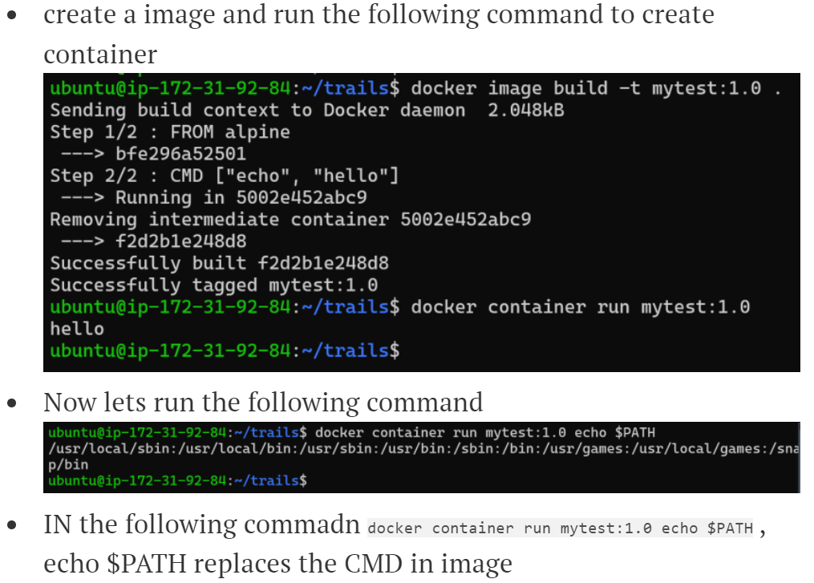
   * **Experiments-2**:
   ```dockerfile
   FROM alpine
   ENTRYPOINT ["echo"]
   CMD ["hello"]
   ```
   * When we start the docker container the command that the container runs is ENTRYPOINT + CMD
   * When we pass additional options, CMD will be overriden not ENTRYPOINT
   * 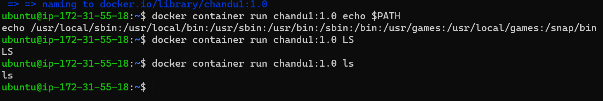


* ## remove-commands
-----------------
```
* container remove command--> `docker container rm <containerid/name>`
* remove all containers--> `docker container rm -f $(docker container ls -a -q)`
* for image remove
  docker image rm -f $(docker image ls -q)
  docker rm <container-id/name>
```
## image layers
---------------
* whenever we pull the image some stuff that is getting downloaded is called as `image layer`.
* Docker image is collection of image layers
* we cant see layers by using inspect command
* ex: `docker image inspect alpine:3`
* In the above case two layers are reused and a new layer is created.
* Docker image layers are read-only.
* The container created from image gets an extra read/write layer.
* Any changes done will be present in the read/write layer of the container not image layer.
* Docker needs a special filesystem which can show the layers mounted on each other as normal file system. To make it possible docker has special file systems such as overlay and union file system.

## node-js 
```dockerfile
FROM node:16

LABEL project="qtlearning"

LABEL author="shaikkhajaibrahim"

RUN git clone https://github.com/gothinkster/angular-realworld-example-app.git

RUN cd angular-realworld-example-app && npm install -g @angular/cli && npm install

EXPOSE 4200

WORKDIR /angular-realworld-example-app

CMD ["ng", "serve", "--host", "0.0.0.0"]
```
```
git clone https://github.com/gothinkster/angular-realworld-example-app.git
cd angular-realworld-example-app
npm install -g @angular/cli
npm install
# To start the application http://localhost:4200
ng serve 
```
* ## multi staged build
-----------------------
* in this to run the applciation i dont need the build tool
* Docker introduced multi staged build for this.
* Image building process is divided into stages, the docker image will contain only the last stage.
```dockerfile
FROM maven:3.8.6-openjdk-11 as build

RUN git clone https://github.com/spring-projects/spring-petclinic.git && \

    cd spring-petclinic && \

    mvn package

# jar location /spring-petclinic/target/spring-petclinic-2.7.3.jar


FROM openjdk:11

LABEL project="petclinic"

LABEL author="devops team"

EXPOSE 8080

COPY --from=build /spring-petclinic/target/spring-petclinic-2.7.3.jar /spring-petclinic-2.7.3.jar

CMD ["java", "-jar", "/spring-petclinic-2.7.3.jar"]
```
* ### docker image for simple flask application
----------------------------------------------
```dockerfile
manuval steps
#git clone https://github.com/Sysnove/flask-hello-world.git
#cd flask-hello-world
#mv hello.py app.py
#pip3 install flask
#flask run -h "0.0.0.0"`
FROM python:3-alpine3.10
LABEL author = "khaja"
EXPOSE 5000
RUN git clone https://github.com/Sysnove/flask-hello-world.git && \
    cd flask-hello-world && \
    mv hello.py app.py && \
    pip3 install flask
WORKDIR /flask-hello-world
CMD ["flask", "run", "-h", "0.0.0.0"]
```
* ### docker image for nop commerce
-----------------------------------
* [refer](https://docs.nopcommerce.com/en/installation-and-upgrading/installing-nopcommerce/installing-on-linux.html) here for manuval steps
```dockerfile
FROM ubuntu:22.04 as unzip
RUN mkdir /Nop
RUN apt update && \
    apt install wget unzip -y && \
    cd /Nop && \
    wget "https://github.com/nopSolutions/nopCommerce/releases/download/release-4.50.3/nopCommerce_4.50.3_NoSource_linux_x64.zip" &&\
    unzip /Nop/nopCommerce_4.50.3_NoSource_linux_x64.zip && \
    rm /Nop/nopCommerce_4.50.3_NoSource_linux_x64.zip


FROM mcr.microsoft.com/dotnet/aspnet:6.0
LABEL author="khaja"
COPY  --from=unzip /Nop /Nop
WORKDIR /Nop
EXPOSE 80
CMD ["dotnet","/Nop/Nop.Web.dll"]
```
* 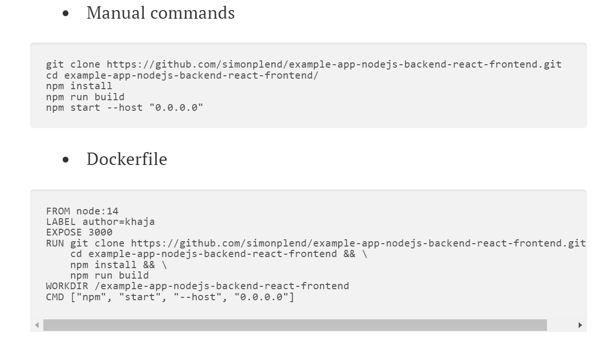
## Problem with Persistence in Containers
---------------------------------------
* Docker container gets a filesystem which is collection of image layers plus read-write layer mounted on each other but it looks like one filesystem.
* Each Docker container gets an thin read-write layer, where the files generated/modified by application are present.
* When container tries to edit existing files in image layers , this will not impact image layers as image layers are read-only.
* Internally docker storage system copies the files from read-only image layers to thin read-write layer before modification. This strategy is called as **Copy-on-write**
* 
* ### storage drivers. [refer](https://directdevops.blog/2019/09/27/impact-of-image-layers-on-docker-containers-storage-drivers/)
* The lifetime of Read-Write layer is equal to lifetime of container i.e. once the container is deleted all the contents of writable layer are also deleted.
* Consider we have a database container which is used by other app containers. The data is written into db container from app containers i.e. all of this is present in Writable layer . Now if we delete db container all the data is lost.
* To solve this problem docker has introduced the concept of Volumes.
# volumes
----------
* Docker volumes purpose is to persist the data even after container is deleted.
* [refer](https://directdevops.blog/2019/10/03/docker-volumes/)for the blog on Docker volumes
* Docker volumes purpose is to persist the data even after container is deleted.
* ##Docker Volume types
  * bind mount
  * Volume
  * tmpfs
* ### **Bind mount:** : Mount existing folder from docker host to any folder in container.
   * Create a folder
   * mount it to the container
   * Create some files
   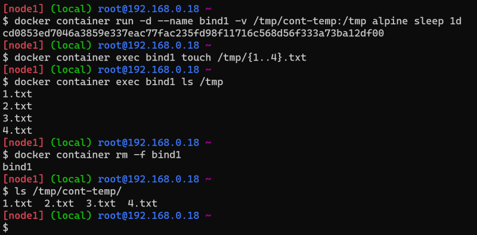
* Now create a new container and mount the files to the same path
* we can see the files whatever we created.
* The same thing can be acheived with **–mount** 

* `docker container run -d --mount "type=bind,source=/tmp/cont-temp,target=/tmp" --name bind6 alpine sleep 1d`
* ### **Volume Mounts:**
 * These are storage spaces generally from docker host which is managed by docker. docker has a sub command `docker volume`
   * create a volume in docker host
   * docker volume create my-vol
   * by using **inspect** we can see the mount path `/var/lib/docker/volume/my-vol/_data`
   * Lets mount the tools folder in alpine container with my-vol 
   *  `docker container run -d --mount "source=my-vol,target=tools" --name vol6 alpine sleep 1d`
   * mysql container -->`docker run --name some-mysql -e MYSQL_ROOT_PASSWORD=my-secret-pw -d mysql`
   * postgress container-->  `docker run --name some-mysql -e MYSQL_ROOT_PASSWORD=my-secret-pw -d postgerss`
   * When we created mysql one volume got created.
   * When we create postgres as well a volume got created automatically
   * 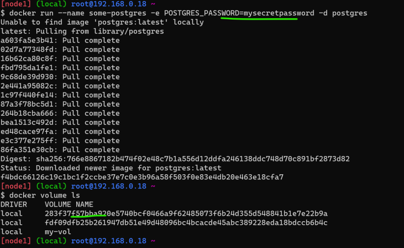
   * This is happening because of VOLUME instruction in Dockerfile.
   * 
   * 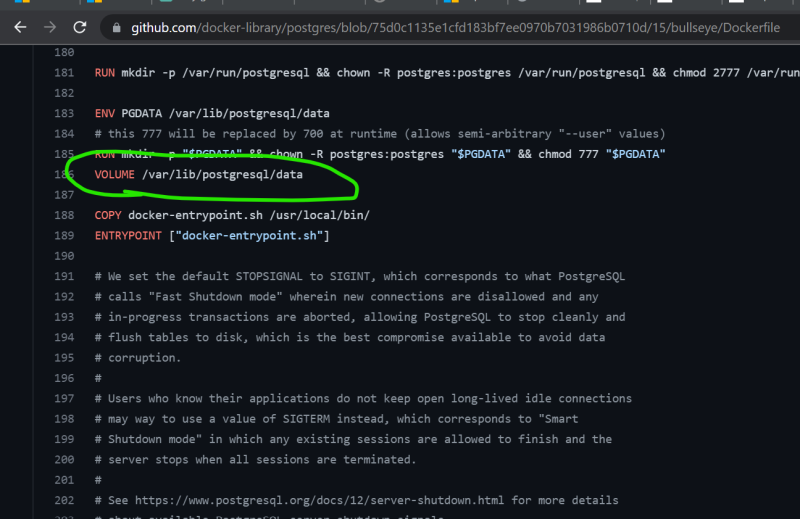
* Generally for stateful application containers, its a good idea to create a VOLUME as part of Dockerfile.
* **note**: [refer](https://directdevops.blog/2022/11/23/devops-classroomnotes-23-nov-2022/) for more aboubt volumes in database
## Networking
---------------
* Every container is getting an ip address
* lets see what are the networks available
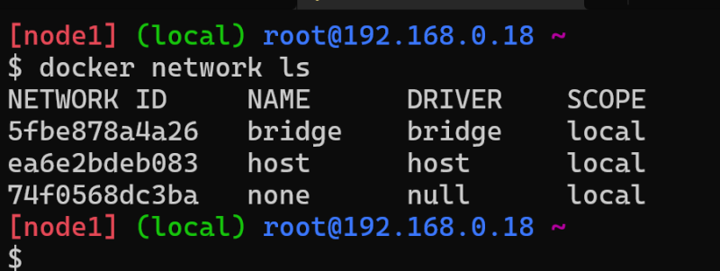
* Two possible Networing options identified
   * Share the same network of docker host to the container
   * Create a new network on the docker host and make it available to the containers. Connect the network created by docker host to the network docker host is connected by using a bridge
* Created a linux vm and verified network interfaces. we had two interfaces
   *loopback (lo) => 127.0.0.1/localhost
   * eth0
* 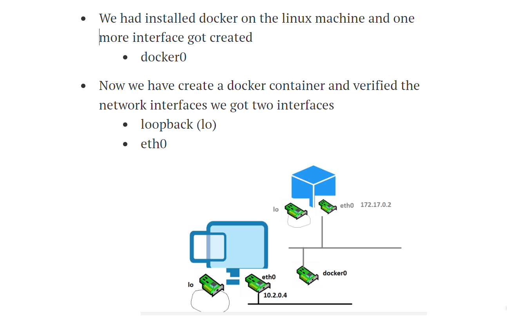
* [refer](https://directdevops.blog/2022/11/24/devops-classroomnotes-24-nov-2022/) here for the 24th/11/22 class
* [refer](https://directdevops.blog/2022/11/25/devops-classroomnotes-25-nov-2022/) here for the 25th/11/22 class
* [refer](https://directdevops.blog/2022/11/26/devops-classroomnotes-26-nov-2022/)for 26th/11/22 morning class
* [refer](https://directdevops.blog/2022/11/26/devops-classroomnotes-26-nov-2022-2/)for 26th/11/22 evening class
* [refer](https://directdevops.blog/2022/11/27/devops-classroomnotes-27-nov-2022-2/)for 27th/11/22 morning class
* [refer](https://directdevops.blog/2022/11/27/devops-classroomnotes-27-nov-2022/)for 27th/11/22 evening class


