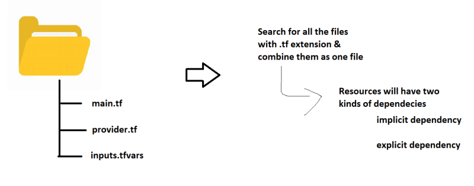
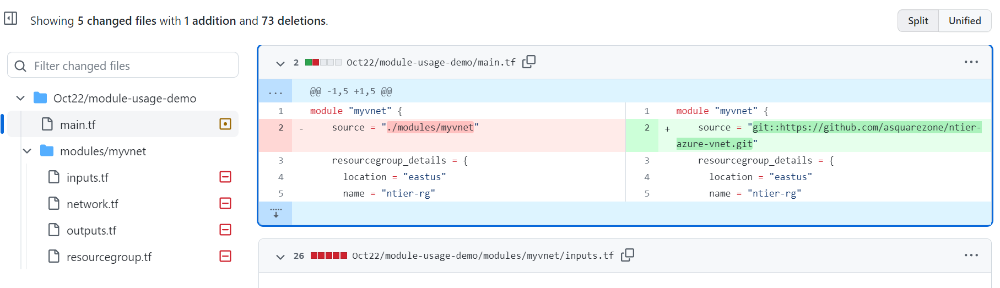
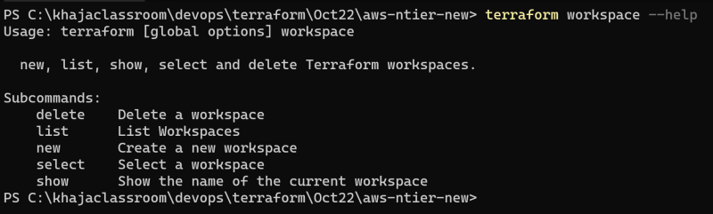

# terraform.

* for deploying application we need infrastructure
* by using this terraform we can create infrastucture
* Infrastructure as Code (IaC)
* This means expressing our infra needs in the form of some template.
* While creating/realizing the infra, pass the dynamic values. 
* IaC which runs on any virtual platform.
* we have to do
  * Define our infrastructure as a template in Terraform   
  * Execute the template to create infrastructure.
* we need to write these templates in Hashicorp Configuration Language (HCL)
* Here we express what we want in the template which is referred as Desired State
* Now when execute terraform will try to create infra to match your Desired State.
## Immutable infrastructure:
------------------------------
*  The approach we are following is immutable infrastructure. Any change in infrastructure can happen by the changes in the template. Every change is stored in version control system i.e. we have history of all the changes.
* 
* ### Idempotence: 
  * This is property which states that executing once or multiple times will have the same result

* ## Provider: 
* Provider: Provider tells terraform where do you want to create the infra, Generally there will be   authentication details as well.

* **ex**
-------- 
```
provider "aws" {
  region     = "us-west-2"
  access_key = "my-access-key"
  secret_key = "my-secret-key"
}
```

* ## Resource 

* The infra component which we want to create, while creating resouce we need to pass some arguments
```
resource "<type-of-resource>" "<name for reference in tf tempalte>" {
    argument_1 = "value_1"
    ...
    argument_n = "value_n"
    #Argument in Terraform is the input given by the user

}
```
**example:**

```
resource "aws_s3_bucket" "first_bucket"  {
    bucket = "qttfoct12"
}
```

## terraform configration with aws
-----------------------------------
* While configuring Provider, Authentication has to be configured
* for this configuration we need access-key and secrect-key for that we have to create iam user.

## working with terraform
-------------------------
* For working with terrafom open terminal ,  create a folder cd into folder where we have terraform templates.
(template should be in .tf extention.)

## init  
----------
*  Downloads the necessary providers into `.terraform` folder
* \.terraform\providers\registry.terraform.io\hashicorp\aws\4.55.0\windows_amd64

## validate
------------
* validate => verify the template for configuration being valid or not.

## apply
--------
* apply => creates/updates the infrastructure
## destory
--------
* it will delete the created resources
## plan
------
it will give the plan of our infrastructure
but not created
## terraform fmt
----------------
* In Terraform, terraform fmt is a command that is used to automatically format your Terraform configuration files in a standardized way.

s3 bucket creation
------------------
```
# This is the aws provider
provider "aws" {
 	region = "ap-south-1"
    access_key = "<your access key>"
    secret_key = "<your secret key>"
}


# This is the s3 bucket resource
resource "aws_s3_bucket" "first_bucket"  {
    bucket = "qttfoct12"
    tags = {
            Name        = "My bucket from tf"
            Environment = "Dev1"
    }
}
```
* **Terraform after creation of resources will create a state file with the details of the resources created in the same folder where we have templates defined. The filename is terraoform.tfstate. Please dont mess with this file.**
## Variables 
------------
* in templates we have directly specified the configuration as part of resource, so the template will not be flexible . it will try to create resources with same configuration all the time.
* We need flexbility where the user should have option to pass/change the values while creating infrastructure.
* This can be acheived by using variables in terraform
```
variable "<name-of-variable>" {
    type = "<type of variable>"
    default = "<default-value>"
    ...
}
```
* [refer here](https://developer.hashicorp.com/terraform/language/values/variables#arguments) for varible arguments.

* simple types are string, number and bool
* pass the variables from command line
* terraform apply -var="target_region=us-west-2" -var="vpc_range=192.168.0.0/16" -auto-approve
## to create vpc with variables
-----------------
* Passing all the variable values from commandline is not sensible, so lets assign values to all the variables in .tfvars file
* [referhere](https://github.com/asquarezone/TerraformZone/commit/ef7a3b6cb4f2bc61a0caa609f81aaa17611d9450#diff-607f380d33f20b3827cadabe4c5cd596c7f0bf9a748eb043f43faca39f7816b4)

* and apply `terraform apply -var-file ".\dev.tfvars" -auto-approve`

## Terraform order of Creation
------------------------------
* 
* Inputs to a resource is argument and output of a resource is attribute
* To use attribute `resource_type.resource_name.<attribute>`
* ### **Implicit Dependency:**
* using attributes of one resource as input i.e arguments to other resource will create implicit . [refer](https://github.com/asquarezone/TerraformZone/commit/a02df5c02a4b1f8207bd6a8fd9160f6d682e3570) for the example
* ### **Explicit dependencies**
* by using explicit dependencies we can control order of creration. by using dependson [refer](https://github.com/asquarezone/TerraformZone/commit/74d15ccc55fc2163f09d263e5c189c617ddbf679) for example.
## count 
--------
* If there is a way to write loops it would simplify the resource creation.
* We can create multiple resources by using count meta-data
* **example**
```
resource "resource-type" "name-of-resource" {
    count = <number-of-resources>
    arg1 = val1
    ...
    argn = valn
}
```
```
resource "aws_vpc" "my_vpc" {
    count = 0
    cidr_block = "192.168.0.0/16"

}
```
* [refer](https://developer.hashicorp.com/terraform/language/meta-arguments/count) for docs.

## conditional expressions
-----------------
* We can also control the creation of resources based on conditional expressions
* [refer](https://developer.hashicorp.com/terraform/language/expressions/conditionals) for docs

## Arguments and Blocks
-----------
* The Terraform language syntax is built around two key syntax constructs: arguments and blocks.
* **argument**--> `image_id = "abc123`
* **block**-->
```
resource "aws_instance" "example" {
  ami = "abc123"

  network_interface {
    # ...
  }
}
```
## To use provider with specific version
--------------------------------------
* Every provider will have many versions to use a specific version of the provider an additional syntax is required
* **example**
```
terraform {
  required_providers {
    aws = {
      source  = "hashicorp/aws"
      version = "~> 4.0"
    }
  }
}

# Configure the AWS Provider
provider "aws" {
  region = "us-east-1"
}
```

* The `~>` symbol means "compatible with" this means
* Specifically, version = "~> 4.0" means that the provider is compatible with any version that is greater than or equal to version 4.0, but less than version 5.0.
## Using count to create multiple subnets in AWS for ntier-architecture
----------------------------------------------
```
* dev.tfvars
-------------
region = "us-west-2"
cidr_block = "10.10.0.0/16"
subnet_cidrs = [ "10.10.0.0/24", "10.10.1.0/24", "10.10.2.0/24", "10.10.3.0/24", "10.10.4.0/24", "10.10.5.0/24" ]
subnet_name_tags = [ "web1", "app1", "db1", "web2", "app2", "db2" ]
subnet_azs = ["us-west-2a","us-west-2a", "us-west-2a", "us-west-2b", "us-west-2b", "us-west-2b"]

* inputs.tf
-----------
variable "region" {
    type        = string
    description = "(optional) region where the resources will be created"
    default     = "us-west-2"
}
variable "cidr_block" {
    type        = string
    default     = "192.168.0.0/16"
}
variable "subnet_cidrs" {
    type        = list(string)
}
variable "subnet_name_tags" {
    type        = list(string)

}
variable "subnet_azs" {
    type        = list(string)
}

* network.tf
------------
# create a vpc
resource "aws_vpc" "ntiervpc" {
    cidr_block = var.cidr_block
    tags = {
      "Name" = "ntier"
    }
}

resource "aws_subnet" "subnets" {
    count = length(var.subnet_cidrs)
    cidr_block = var.subnet_cidrs[count.index]
    vpc_id = aws_vpc.ntiervpc.id
    availability_zone = var.subnet_azs[count.index]
    tags = {
      "Name" = var.subnet_name_tags[count.index]
    }
    depends_on = [
      aws_vpc.ntiervpc
    ]
}
```
##   dynamically create subnet cidr’s
--------------------------------------
```
* dev.tfvars
-------------
region = "us-west-2"
cidr_block = "192.168.0.0/16"
subnet_name_tags = [ "web1", "app1", "db1", "web2", "app2", "db2", "mgmt" ]
subnet_azs = ["us-west-2a","us-west-2a", "us-west-2a", "us-west-2b", "us-west-2b", "us-west-2b", "us-west-2"]

* inputs.tf
--------------
variable "region" {
    type        = string
    description = "(optional) region where the resources will be created"
    default     = "us-west-2"
}
variable "cidr_block" {
    type        = string
    default     = "192.168.0.0/16"
}


variable "subnet_name_tags" {
    type        = list(string)

* network.tf
------------
# create a vpc
resource "aws_vpc" "ntiervpc" {
    cidr_block = var.cidr_block
    tags = {
      "Name" = "ntier"
    }
}

resource "aws_subnet" "subnets" {
    count = length(var.subnet_name_tags)
    cidr_block = cidrsubnet(var.cidr_block,8,count.index)
    vpc_id = aws_vpc.ntiervpc.id
    availability_zone = var.subnet_azs[count.index]
    tags = {
```
## enable Debug logs in terraform
---------------------------------
* To enable debug logs in Terraform, you can set the `TF_LOG` environment variable to the value debug. 
* This will cause Terraform to output more detailed logs, which can be helpful in troubleshooting issues.
* ### steps to enable debug logs in Terraform
* Set the TF_LOG environment variable to debug by running the following command:   
* Linux and macOS users-->`export TF_LOG=debug`
* windows users--> `set TF_LOG=debug`
## disable debug logs in terraform
----------------------------------
* linux and macos users--> `unset TF_LOG`
* for windows--> `set TF_LOG=`

## **output**-->
*  "output" is a way to declare a value that should be made available to the user after a successful Terraform apply operation.
```
* **ex** 
output "vnetid" {
    value = azurerm_virtual_network.ntier_vnet.id
output "subnetcount" {
    value = length(azurerm_subnet.subnets)
```

## modules.
-----------
* Reusability is essential as we follow principle DRY (Dont Repeat Yourself)
* In Terraform, if we need reusability we need to create modules.
* Terraform has lot of modules developed by communities and terraform stores them in terraform registry 
## creation
* Create a directory for the module, and create a file named main.tf inside it.
* Write your Terraform configuration for the module in the main.tf file.
* Optionally, create other files and directories to organize your module's configuration. For example, you may want to create a variables.tf file to define input variables for the module, or a outputs.tf file to define output values.
* Optionally, create a README.md file to document how to use the module
* Publish the module to a module registry, such as the Terraform Registry, so that it can be easily shared and used by others.
* [refere](https://developer.hashicorp.com/terraform/language/modules/sources) for other sources.

### Lets use terraform aws-vpc module to create 6 subnets
------------------
[refer](https://github.com/asquarezone/TerraformZone/commit/5550f47e9d0ced7b05ce16dd5e308b3da0af4222) 


## Datasource
--------------
* Datasource help in fetching the information about some resources in the provider.
```
data "aws_instance" "example" {
  instance_id = "i-0123456789abcdef0"
}

output "instance_private_ip" {
  value = data.aws_instance.example.private_ip

*example is used to pull the defult vpc id of mumbai region and subnetids of any vpc from az ap-south-1a*

data "aws_vpc" "default" {
    default = true
}

data "aws_subnets" "subnetids" {
    filter {
      name = "availability-zone"
      values = [ "ap-south-1a" ]
    }
```
## security group
-------------
```
resource "aws_security_group" "rds_sg" {
    description = "Created by terraform for mysql"
    ingress   {
      cidr_blocks = [ local.anywhere ]
      description = "open mysql"
      from_port = local.mysql_port
      protocol = local.tcp
      to_port = local.mysql_port

    } 
    vpc_id = module.vpc.vpc_id
    depends_on = [
      module.vpc
    ]
    tags = {
      "Name" = "openmysql"
    }
```
## db-subnet group and db-instence
----------------------------------
```
# dbsubnet group

resource "aws_db_subnet_group" "mysqldbsubnetgroup" {
    name = "mysqldbsubnetgroup"
    subnet_ids = [ module.vpc.private_subnets[local.db_subnet_1], module.vpc.private_subnets[local.db_subnet_2] ]
    depends_on = [
      module.vpc
    ]
}


resource "aws_db_instance" "default" {
  allocated_storage    = 20
  db_name              = "qtrdsfromtf"
  engine               = "mysql"
  engine_version       = "5.7"
  instance_class       = "db.t2.micro"
  username             = "root"
  password             = "rootroot"
  skip_final_snapshot  = true
  depends_on = [
    module.vpc,
    aws_db_subnet_group.mysqldbsubnetgroup
  ]
  vpc_security_group_ids = [aws_security_group.rds_sg.id]
  db_subnet_group_name = aws_db_subnet_group.mysqldbsubnetgroup.name
}
```
* any doubts about above [refer](https://directdevops.blog/2022/10/26/devops-classroomnotes-26-oct-2022/)
## db-subnet-group
------------------
* In Terraform, aws_db_subnet_group is a resource type that creates a subnet group for a specific Amazon Web Services (AWS) database instance. The subnet group specifies the subnets that the database instance can use in a particular Virtual Private Cloud (VPC).
```
resource "aws_db_subnet_group" "example" {
  name       = "example-subnet-group"
  subnet_ids = ["subnet-12345678", "subnet-23456789", "subnet-34567890"]
  tags = {
    Name = "example-subnet-group"
  }
}
```
## Taint resources using terraform
-----------------------------------
* In Terraform we have options to taint
* **Taint**: During next apply delete and recreate the resource
* syntax for taint is `terraform taint <resource_type>.<resource_name>`
* To unmark a resource tainted for replacement we can untaint before next terraform appply to undo the taint.
`terraform taint <resource_type>.<resource_name>`
* if you accidentally taint a critical resource, it could result in downtime or data loss. It's recommended to use this command only when necessary and with a clear understanding of the potential impacts.

## graph
--------
* by using this command we can see the graph of our infra 
* `terraform graph | dot -Tsvg > graph.svg`
* To generate a graph, run the `terraform graph` command in the same directory as your Terraform configuration. The command will output a graph in the DOT format, which can be viewed using a graph visualization tool like Graphviz.
## ec2- creation
```
resource "aws_instance" "webec2" {

    ami = var.ami-id

    associate_public_ip_address = true

    instance_type = "t2.micro"

    key_name = "my_key_pair"

    vpc_security_group_ids = [ aws_security_group.web_sg.id]

    subnet_id = module.vpc.public_subnets[0]

    tags = {

      "Name" = "web"

    }


    depends_on = [

      module.vpc,

      aws_security_group.web_sg

    ]


}
```
## Terraform Provisioning
-------------------------
* Terraform provisioning is used to perform extra operations after resources are created.
* That could be generally executing scripts
* There are three provisioners[refehere](https://developer.hashicorp.com/terraform/language/resources/provisioners/remote-exec)
  * local-exec: 
  * remote-exec:
  * file
* To connect to the remote instance we need connection
```
resource "aws_instance" "webec2" {
    ami = var.ami-id
    associate_public_ip_address = true
    instance_type = "t2.micro"
    key_name = "my_key_pair"
    vpc_security_group_ids = [ aws_security_group.web_sg.id]
    subnet_id = module.vpc.public_subnets[0]
    tags = {
      "Name" = "web"
    }
    depends_on = [
      module.vpc,
      aws_security_group.web_sg
    ]


    provisioner "remote-exec" {

      connection {
        type = "ssh"
        user = "ubuntu"
        private_key = file("~/.ssh/id_rsa")
        host = aws_instance.webec2.public_ip 
      }

      inline = [
        "sudo apt update",
        "sudo apt install nginx -y"
      ]

    }

}
```
* Terraform provisioner will be run only when the resource is created.
* Lets make changes in remote-exec inline Refer Here and try to perform terraform apply. Terraform will not consider the changes in remote-exec as desired state, so nothing will be executed.
* Provisoner without a resource can be used to solve this problem
## null resource
----------------
* In the null resource create a triggers which maps to certain input from the user which triggers script execution
```
resource "null_resource" "webprovisoner" {
  triggers = {
    running_number = var.web-trigger
  }

  provisioner "remote-exec" {

      connection {
        type = "ssh"
        user = "ubuntu"
        private_key = file("~/.ssh/id_rsa")
        host = aws_instance.webec2.public_ip 
      }
      inline = [
        "sudo apt update",
        "sudo apt install nginx -y",
        "sudo apt install tree -y"
      ]

    }
    depends_on = [ aws_instance.webec2 ]

}
```
## Terraform backend s3
------------------------
* As of now the terraform state is maintained in the local folder. when we try to execute the same infra from different system it also generates a new state file which means new resources will be provisioned again.
* solution for this is provided by terraform backends
* Backend is location where your state file gets stored.
* Default backend is local. This is the reason why .tfstate is shown in local folder where we have templates.

## Terraform backend s3
-----------------------
* The state file gets stored in aws s3.
* But terraform s3 backend doesnot support locking. 
* To perform locking terraform expects a dynamo db table to be created
* for docs [refe](https://developer.hashicorp.com/terraform/language/settings/backends/s3)
```
terraform {
  backend "s3" {
        bucket = "thisisforterraform"
        key = "ntierdeploydev"
        region = "us-west-2"
        dynamodb_table = "thisisforteraform"

  }
}
```
* * After adding backend information execute terraform init
## Terraform Workspaces
-----------------------
* Terraform workspaces allows us to create locking per workspace.
* Each workspace can be considered as one environment
* 
* Create multiple workspaces depending on environments
```
resource "aws_instance" "example" {
  count = "${terraform.workspace == "default" ? 5 : 1}"

  # ... other arguments
}
```
## create a mysql database using terraform in aws
---------------------------------------------
```
*# Provider configuration for AWS
provider "aws" {
  region = "us-west-2"
}

# Security Group for the database instance
resource "aws_security_group" "mysql" {
  name_prefix = "mysql"
  
  ingress {
    from_port = 3306
    to_port = 3306
    protocol = "tcp"
    cidr_blocks = ["0.0.0.0/0"]
  }
}

# MySQL database instance creation
resource "aws_db_instance" "example_mysql" {
  allocated_storage = 10
  engine = "mysql"
  engine_version = "5.7"
  instance_class = "db.t2.micro"
  name = "example_mysql_db"
  username = "admin"
  password = "password"
  parameter_group_name = "default.mysql5.7"
  storage_type = "gp2"
  vpc_security_group_ids = [aws_security_group.mysql.id]
}
```
## How to use multiple providers with same name
-------------------------------------------
```
#network.tf
------------
resource "aws_vpc" "primaryvpc" {

    provider = aws.primary

    cidr_block = "192.168.0.0/16"

}
resource "aws_vpc" "secondary" {

    provider = aws.secondary

    cidr_block = "10.0.0.0/16"
}


output "primaryvpcid" {

    value = aws_vpc.primaryvpc.id
}
output "secondaryvpcid" {

    value = aws_vpc.secondary.id
}
#provider.tf
------------
terraform {
  required_providers {
    aws = {
      source  = "hashicorp/aws"
      version = "~> 4.0"
    }
  }
}

# configure aws provider that depends on credentials in
# HOME-DIR/.aws/credentials
provider "aws" {
    region = "us-west-2"
    alias = "primary"
}

provider "aws" {
    region = "us-west-1"
    alias = "secondary"
}
```
## Dynamic Block
---------------
* In Terraform, dynamic blocks can be used to generate and manage multiple instances of a configuration block dynamically, based on the value of a variable or a set of values.
```
variable "subnet_ids" {
  type = list(string)
  default = ["subnet-abc123", "subnet-def456", "subnet-ghi789"]
}

resource "aws_instance" "example" {
  ami = "ami-0c55b159cbfafe1f0"
  instance_type = "t2.micro"
  
  dynamic "network_interface" {
    for_each = var.subnet_ids
    content {
      subnet_id = network_interface.value
    }
  }
}
```
* In this example, the `aws_instance` resource block uses a dynamic block to create multiple network interfaces based on the values of the `subnet_ids` variable. The `for_each` argument is used to iterate over the list of subnet IDs and create a network interface for each one.

* The `content` block defines the configuration of each network interface, using the `subnet_id` attribute to set the value of the subnet ID for each interface.


## screts
* awscl-->.aws-->credentioals-->in that we can mention
* export acsesskey ans secreat key as a everonmental variables.
* terraform vult.
## terrform version manager 
* we should install terraform version manager 
* tfrnv list-remote --->we can see all list of tf versions
* `<tfenv install'thatparticularversion>`
* we can switch `tfevn use <version> `

import resources
----------------
** `terraform import <resource type> <resource-name> id `
* we have to create an empty block git creadintioal to on that
* next do inti and plan and aply

* we get those resources into .state file
* we can re construct the terraform body(code)

userdata
---------
* user_data = `"${file("coammands.sh")}"`


**terraform refresh**


	


